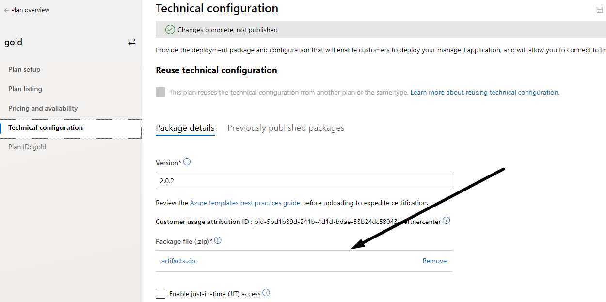
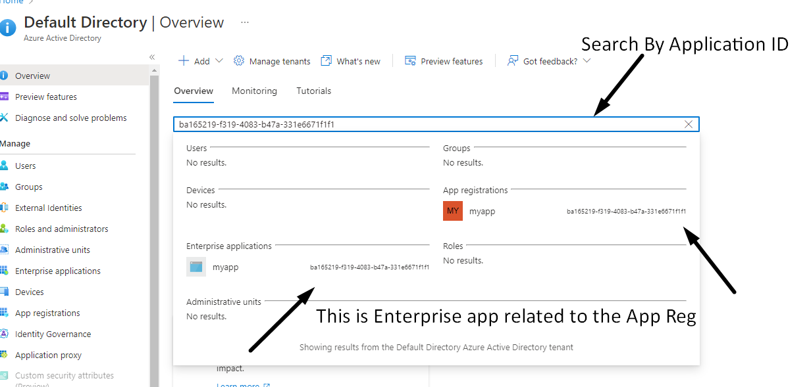
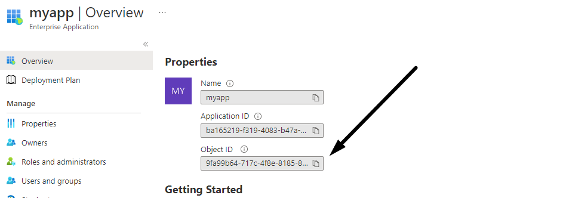
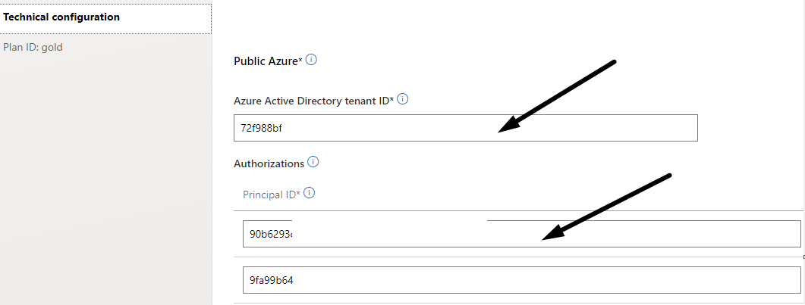
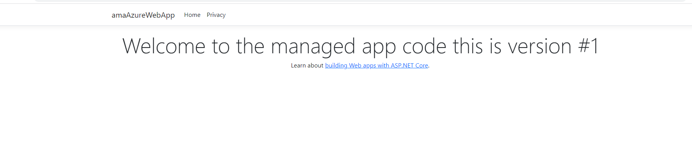
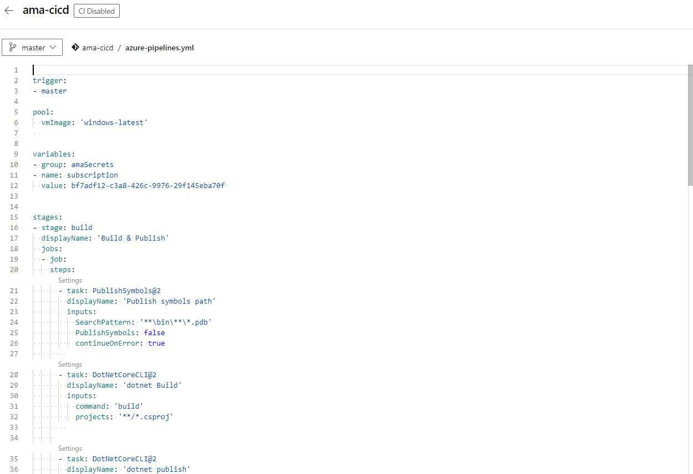
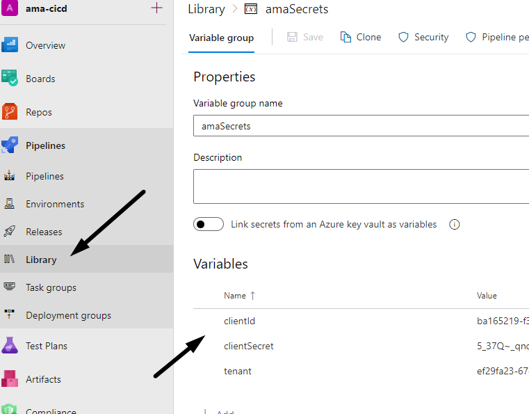
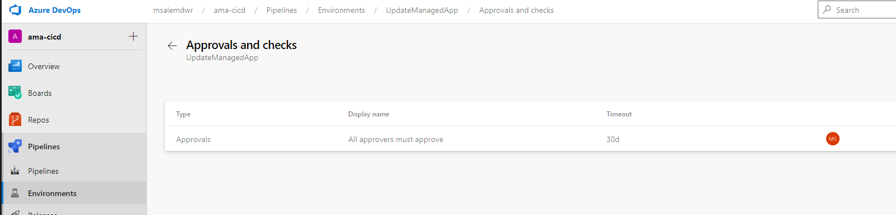
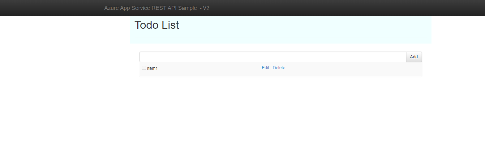

# Azure Managed App CI/CD Demo
The goal of this demo to demenstrate how to build azure pipeline to modify and update azure managed application artifacted in customer environment.

# Requirement
The demo requirement knoweldage about 
1. [Create and published managed app](https://docs.microsoft.com/en-us/azure/azure-resource-manager/managed-applications/overview)
1.  [Azure pipeline](https://docs.microsoft.com/en-us/azure/devops/pipelines/get-started/what-is-azure-pipelines?view=azure-devops)

# Learning Resources
It is highly recommended to review the following material before starting this demo
1. [Managed Applications for the Microsoft Marketplace - Workshop](https://aka.ms/AMAWorkshop)
1. [Customize your pipeline](https://docs.microsoft.com/en-us/azure/devops/pipelines/customize-pipeline?view=azure-devops)
1. [Create Azure AD App Registration](https://docs.microsoft.com/en-us/azure/active-directory/develop/howto-create-service-principal-portal)
# Prerequisites
Before using the demo, the following components should exist
1. Azure managed app offer with one plan at least
1. AD App Registration and Its corresponding Enterprise App
> [!NOTE]
> AD App Registration will be used as part of the managed app plan technicat configuration and also as part of Azure pipeline 

## Publish the managed app demo
1. User `artificate.zip` under `arm folder` and upload it to azure managed offer plan

1. Locate the `Object ID` for the `Enterprise App`

1. Enter the `objbect ID` and `AD tenant`

1. Save Draft 
1. Review and publish

## Deploy published managed app
> [!NOTE]
> It is highly recommended to use a **different tenant** for deployment to demoenstrate customer environment
1. Deploy the managed app from marketplace, please refer to this [link](https://docs.microsoft.com/en-us/azure/marketplace/azure-app-test-publish) 
1. Access the managed resources group and open the webapp url and you should see the following webpage

## Deploy modified Artifact to managed app
1. Modify the web application source code.. add extra header line or change logo
1. Establish Azure pipeline using Azure-pipline.yaml file , please to this article as guide on [HOW-TO Establish Pipeline](https://docs.microsoft.com/en-us/azure/devops/pipelines/customize-pipeline?view=azure-devops)

1. Add new azure library `amaSecrets` and add AD app registration clientID, Secret and tenants, Please refer to this article on [HOW-TO add variable Group](https://docs.microsoft.com/en-us/azure/devops/pipelines/library/variable-groups?view=azure-devops&tabs=yaml)

1. Add new environment call it UpdateManagedApp
1. Add yourself or other AD User as Approval for the environment, please refer to this articale on [HOW-TO Create pipeline Environment](https://docs.microsoft.com/en-us/azure/devops/pipelines/process/environments?view=azure-devops) 

1. Run pipeline
1. After it finish, access managed app webapp and confirm it was updated

As you see the managed app reflect the new site version

